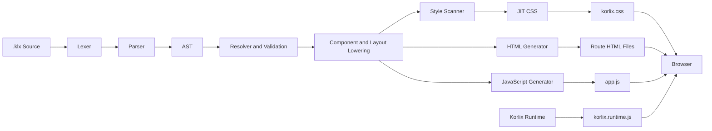

<div align="center">

# Korlix

### A frontend language for building websites with readable `.klx` files

Korlix brings pages, components, styling, state, events, API calls, themes, and routing into one indentation-based language, then compiles the project into browser-native **HTML**, **CSS**, and **JavaScript**.

<br />

[](https://www.npmjs.com/package/korlix)
[](https://www.npmjs.com/package/create-korlix)
[](https://www.npmjs.com/package/korlix)
[](https://www.npmjs.com/package/create-korlix)
[](https://www.rust-lang.org/)
[](LICENSE)

<br />

[Getting Started](#quick-start) ·
[Language Overview](#language-overview) ·
[Components](#component-system) ·
[Documentation](#documentation) ·
[Examples](examples) ·
[Roadmap](#roadmap)

<br />

**Korlix = Kor + Lix = The Core Matrix**

</div>

---

## What is Korlix?

Korlix is a frontend-focused programming language and compiler that uses the `.klx` file extension.

It is designed for developers who want to create websites and browser applications without splitting the interface across separate HTML templates, CSS frameworks, state libraries, component frameworks, and request utilities.

A Korlix source file can define:

- Pages and routes
- Shared layouts
- Reusable components
- Native HTML and SVG elements
- Reactive state
- Functions and events
- Conditions and loops
- Forms and validation-oriented controls
- Responsive styles
- Light and dark themes
- API queries and HTTP mutations
- Pagination, modals, drawers, toasts, and other UI behavior

Korlix compiles these declarations into standard browser output:

```text
.klx source files
        ↓
Lexer and parser
        ↓
Semantic validation
        ↓
Component and layout lowering
        ↓
JIT style generation
        ↓
HTML + CSS + JavaScript
```

Korlix does not require React, Vue, Angular, Bootstrap, or Tailwind CSS in the generated browser application. Interactive features use the Korlix browser runtime.

---

## Why Korlix?

Modern frontend development often requires several separate technologies before a page can become interactive:

```text
Markup
+ styling framework
+ component framework
+ state management
+ router
+ API client
+ build tooling
```

Korlix provides one language-level model for the common parts of that workflow.

| Requirement | Korlix approach |
|---|---|
| Page structure | Indentation-based `.klx` elements |
| Routing | Route declared directly on a page |
| Components | Reusable components with props and slots |
| Styling | JIT utilities, semantic colors, and responsive variants |
| State | Reactive `state` declarations |
| Interaction | Functions and event properties |
| Data | Declarative queries and HTTP mutations |
| Themes | Light, dark, and automatic modes |
| Output | Standard HTML, CSS, and JavaScript |

Korlix is intended to make ordinary frontend code easier to read while preserving browser-native output.

---

## Quick Start

### Create a project with npm

Requires Node.js 18 or newer.

```bash
npm create korlix@latest my-app
cd my-app
npm install
npm run dev
```

Open:

```text
http://localhost:3000
```

Other package managers:

```bash
yarn create korlix my-app
pnpm create korlix my-app
bun create korlix my-app
```

### Install the Korlix CLI

```bash
npm install --global korlix
```

Verify the installation:

```bash
korlix --version
```

Create and run a project:

```bash
korlix new my-site
cd my-site
korlix check
korlix dev
```

> Use `korlix dev` to run a project. There is no `korlix run` command.

---

## First Korlix Page

Create `src/pages/index.klx`:

```klx
page Home at "/"
  state count: int = 0

  main .min-h-screen .surface-canvas .content-content
    section .max-w-4xl .mx-auto .px-6 .py-20
      badge variant=soft "Korlix"

      h1 .text-5xl .font-bold "Build the web with simpler code"

      p .text-lg .content-content-muted
        "Pages, state, components, themes, and API calls in one language."

      card variant=raised
        h2 "Interactive counter"
        p "Current value: {count}"

        row .gap-3
          button "Increase" variant=primary click
            count += 1

          button "Reset" variant=outline click
            count = 0
```

Run:

```bash
korlix check
korlix dev
```

---

## Korlix at a Glance

The example below demonstrates an application layout, a reusable component, a page route, state, an API query, responsive styles, iteration, pagination, and an event-driven function.

```klx
app StoreApplication
  layout MainLayout
  theme auto

layout MainLayout
  navbar variant=glass
    strong "Korlix Store"
    link href="/products" "Products"
    theme-toggle

  main
    slot

component ProductSummary
  prop name: string
  prop price: number

  product-card variant=raised
    h3 "{name}"
    p "Price: {price}"

page Products at "/products"
  state page: int = 1
  state count: int = 0

  get products "/api/products"

  if productsLoading
    spinner
  else
    grid .grid-cols-1 .md:grid-cols-2 .xl:grid-cols-4
      for product in products
        ProductSummary
          name=product.name
          price=product.price

  pagination
    page=page
    total=100
    perPage=20
    url-sync

  button "Count: {count}" variant=primary click=increment

  fn increment
    count += 1
```

---

## Current Implementation

| Area | Current implementation |
|---|---|
| Source extension | `.klx` |
| Compiler | Rust workspace |
| Generated output | HTML, CSS, and JavaScript |
| Stable build target | Static multipage applications |
| Experimental target | SPA output |
| Native element names | 137 HTML and SVG names |
| Registered component names | 115 |
| Schema-defined components | 35 |
| Public color families | 26 |
| Color levels | `0` through `12` |
| Utility classes | More than 1,000 |
| Color utility combinations | More than 5,500 |
| Themes | Light, dark, and automatic |
| Runtime modules | State, events, API, router, theme, toast, overlays, pagination, and HMR |

> The 115 registered component names do not all have the same implementation depth. Some components have dedicated schemas and specialized rendering, while others currently use the generic component renderer.

---

# Language Overview

## Applications

An application declaration can configure a shared layout and theme.

```klx
app DocumentationSite
  layout DocumentationLayout
  theme auto
```

Supported theme modes:

```text
light
dark
auto
```

---

## Pages and Routes

V2 syntax:

```klx
page About at "/about"
  h1 "About Korlix"
```

Legacy V1 syntax remains accepted during migration:

```klx
page About route "/about":
  h1 "About Korlix"
```

Static builds generate directory-based routes:

```text
/              → dist/index.html
/about         → dist/about/index.html
/products      → dist/products/index.html
```

---

## Layouts

Layouts define structure shared by multiple pages.

```klx
layout MainLayout
  navbar
    link href="/" "Home"
    link href="/docs" "Documentation"
    theme-toggle

  main
    slot

  footer
    p "Built with Korlix"
```

Layout selection order:

1. Page-specific layout
2. Application default layout
3. No layout

---

## Imports

```klx
import MainLayout from "./layouts/main.klx"
import UserCard from "./components/user-card.klx"
import "./setup.klx"
```

Imported aliases can be used for layouts and user-defined components.

---

## State and Values

```klx
state count: int = 0
state loading: bool = false
state users = []
state currentUser = null

let pageSize = 20
derived total = price * quantity
```

Reactive page state is generated through the Korlix runtime.

Current limitation:

- Top-level `let` initialization is incomplete.
- Reactive recomputation of top-level `derived` values is incomplete.

---

## Functions and Actions

```klx
fn increase(step)
  count = count + step

action reset
  count = 0
```

Supported function-body operations include:

- Local `let` values
- Assignments
- `+=` and `-=`
- Function calls
- Conditions
- Loops
- API requests
- Query reloads

---

## Conditions

```klx
if loading
  spinner
else
  p "Loaded"
```

---

## Loops

```klx
for user in users
  profile-card
    h3 "{user.name}"
    p "{user.role}"
```

---

## Expressions

Korlix supports:

- String, integer, float, Boolean, and null literals
- Lists and records
- Arithmetic operators
- Comparison operators
- Logical operators
- Member access
- Index access
- Function calls
- String interpolation

```klx
state total = price * quantity
state visible = active and not loading

p "Welcome, {user.profile.name}"
```

---

## Events

Direct event function:

```klx
button "Save" click=save
input input=updateSearch
form submit=submitForm
```

Inline event block:

```klx
button "Increase" click
  count += 1
```

Supported event groups include:

- Click and double-click
- Input and change
- Form submission
- Focus and blur
- Keyboard events
- Mouse events
- Scroll
- Drag and drop
- Touch events

---

# Component System

## User Components

```klx
component UserCard
  prop name: string
  prop role: string = "Member"
  prop active: bool = true

  card variant=raised
    h3 "{name}"
    p "{role}"

    if active
      badge variant=success "Active"

    slot
```

Usage:

```klx
UserCard name="Sachin" role="Administrator"
  button "Open profile" click=openProfile
```

Implemented component-language features:

- Required props
- Typed props
- Default prop values
- Default slots
- Imported aliases
- Recursive expansion protection
- Missing required-prop diagnostics
- Basic literal type validation

Current limitations include named-slot invocation, event forwarding, and complete component-instance state isolation.

---

## Built-in Component Catalogue

Korlix registers 115 component names across these groups:

| Group | Representative components |
|---|---|
| Navigation | `navbar`, `sidebar`, `breadcrumb`, `tabs`, `stepper` |
| Content | `card`, `product-card`, `profile-card`, `pricing-card`, `stat-card` |
| Forms | `input`, `select`, `checkbox`, `switch`, `date-picker`, `file-upload` |
| Feedback | `alert`, `toast`, `spinner`, `skeleton`, `empty-state` |
| Overlays | `modal`, `drawer`, `tooltip`, `dropdown`, `popover` |
| Data | `table`, `data-table`, `pagination`, `calendar`, `data-grid` |
| Media | `carousel`, `gallery`, `video-player`, `audio-player` |
| Layout | `container`, `row`, `column`, `grid`, `stack` |

### Component maturity

- **35 schema-defined components** have dedicated props, slots, and output rules.
- **80 generic components** use shared variant, size, disabled, and slot behavior.
- A smaller group has specialized lowering or browser-runtime behavior.

Specialized components currently include:

```text
button, link, icon, image, avatar, card, navbar, footer,
container, section, hero, badge, alert, spinner, skeleton,
empty-state, toast, modal, drawer, pagination, progress,
theme-toggle
```

See:

- [Components](docs/07-components.md)
- [V2 Component Catalogue](docs/15-component-catalog-v2.md)

---

# HTML and SVG Support

Korlix recognizes 137 modern HTML and common SVG element names.

Supported categories include:

- Document metadata
- Semantic page structure
- Text and inline semantics
- Lists
- Forms
- Tables
- Images, audio, and video
- Embedded content
- Interactive elements
- Templates
- SVG shapes, gradients, masks, clipping, and filters

Example:

```klx
article
  header
    h1 "Korlix Language Design"
    time datetime="2026-07-19" "19 July 2026"

  p "Korlix uses native semantic web elements."

  figure
    img
      src="/images/compiler.png"
      alt="Korlix compiler architecture"

    figcaption "The Korlix compilation pipeline"
```

Recognized void elements include:

```text
area, base, br, col, embed, hr, img,
input, link, meta, source, track, wbr
```

---

# Styling and Colors

Korlix includes a JIT style engine that generates CSS only for utilities detected in source files.

## Korlix-native color properties

```text
surface-
content-
outline-
accent-
fill-
stroke-
ring-color-
caret-color-
```

Example:

```klx
card
  .surface-violet-2
  .content-violet-11
  .outline-violet-4
```

Traditional utility aliases are also supported:

```text
text-
bg-
border-
ring-
fill-
stroke-
outline-
caret-
placeholder-
```

```klx
div .bg-indigo-600 .text-white .border-indigo-700
```

---

## Color Families

Base families:

```text
slate, gray, zinc, red, orange, amber, yellow,
green, emerald, teal, cyan, blue, indigo,
violet, purple, pink, rose
```

Aliases:

```text
neutral, ash, stone, sand, lime, mint,
sky, coral, magenta
```

Each public family exposes Korlix levels:

```text
0, 1, 2, 3, 4, 5, 6, 7, 8, 9, 10, 11, 12
```

---

## Semantic Theme Tokens

```text
canvas
surface
raised
overlay
content
content-muted
outline
brand
success
warning
danger
info
```

Example:

```klx
section .surface-canvas .content-content
  card .surface-raised .outline-outline
    h2 "Theme-aware content"
```

---

## Responsive Variants

| Prefix | Minimum width |
|---|---:|
| `sm:` | 576 px |
| `md:` | 768 px |
| `lg:` | 992 px |
| `xl:` | 1200 px |
| `2xl:` | 1400 px |

```klx
grid .grid-cols-1 .md:grid-cols-2 .xl:grid-cols-4
```

---

## Interaction Variants

```text
hover
focus
focus-visible
active
visited
disabled
checked
invalid
valid
group-hover
peer-checked
dark
data-open
motion-safe
motion-reduce
print
```

Example:

```klx
button
  .bg-indigo-600
  .hover:bg-indigo-700
  .focus:ring-indigo-400
  .disabled:opacity-50
```

---

## Arbitrary Values

```klx
div .w-[320px]
div .h-[calc(100vh-4rem)]
div .surface-[#101827]
div .grid-cols-[240px_1fr]
```

---

# Themes

Configure the application theme:

```klx
app MyApplication
  theme auto
```

Use the built-in control:

```klx
theme-toggle
```

Or invoke theme behavior:

```klx
button "Change theme" click=toggleTheme
```

The runtime supports:

- Light mode
- Dark mode
- Automatic system mode
- Saved user preference
- `data-kx-theme`
- Browser `color-scheme`
- System theme change detection
- `kx:theme-change` events

---

# API Requests

## Declarative GET Query

```klx
get users "/api/users"
```

The compiler exposes:

```text
users
usersLoading
usersError
```

Example:

```klx
page Users at "/users"
  get users "/api/users"

  if usersLoading
    spinner
  else
    for user in users
      profile-card
        h3 "{user.name}"
```

---

## HTTP Mutations

```klx
post "/api/users" user
put "/api/users/1" user
patch "/api/users/1" changes
delete "/api/users/1"
```

Reload a query:

```klx
reload users
```

Runtime API:

```javascript
KorlixRuntime.api.get(url, options)
KorlixRuntime.api.post(url, body, options)
KorlixRuntime.api.put(url, body, options)
KorlixRuntime.api.patch(url, body, options)
KorlixRuntime.api.delete(url, options)
KorlixRuntime.api.reload(name)
```

The runtime uses browser `fetch`, handles JSON and text responses, and tracks loading and error state.

Current API-language limitations include declarative headers, authentication, retries, caching, timeouts, cancellation, and typed response shapes.

---

# Pagination

```klx
pagination
  page=currentPage
  total=totalRecords
  perPage=20
  siblings=1
  url-sync
```

Implemented behavior:

- First and last page controls
- Previous and next controls
- Numbered pages
- Ellipsis
- Disabled boundary states
- `aria-current`
- Total-record calculation
- URL query synchronization
- `change` and `kx:page-change` events

---

# Built-in Runtime Functions

Korlix functions can dispatch the following browser actions:

```text
toast
showToast
openModal
closeModal
openDrawer
closeDrawer
navigate
goBack
toggleTheme
scrollTo
copyToClipboard
log
```

Example:

```klx
fn copyCode
  copyToClipboard(code)
  toast("success", "Copied")
```

Runtime modules include:

- Reactive state
- Event handling
- API requests
- Router foundations
- Theme management
- Toast notifications
- Modal and drawer overlays
- Pagination
- Development hot updates

---

# Architecture



## Rust Workspace

| Crate | Responsibility |
|---|---|
| `korlix-cli` | Command-line interface |
| `korlix-core` | Configuration, diagnostics, and source handling |
| `korlix-lexer` | Tokenization and indentation |
| `korlix-parser` | Tokens to AST |
| `korlix-ast` | Language syntax structures |
| `korlix-resolver` | Imports, files, routes, and symbols |
| `korlix-style` | Utility registry and JIT CSS |
| `korlix-components` | Component schemas and expansion |
| `korlix-runtime-plan` | Runtime feature analysis |
| `korlix-codegen` | HTML, CSS, JavaScript, and route generation |
| `korlix-dev-server` | Development server and hot updates |
| `korlix-compiler` | Whole-project compilation pipeline |

---

# CLI Reference

| Command | Purpose |
|---|---|
| `korlix new <name>` | Create a Korlix project |
| `korlix dev` | Build and start the development server |
| `korlix check` | Parse, validate, and lint `.klx` files |
| `korlix check --ast` | Print the parsed AST as JSON |
| `korlix build --mode static` | Build a static multipage website |
| `korlix build --mode spa` | Build experimental SPA output |
| `korlix preview --port 4173` | Preview the production build |

The CLI currently accepts `--a11y`, `--security`, and `--seo`, but their dedicated analysis passes are not complete.

---

# Build from Source

Requirements:

- Rust 1.75 or newer
- Git
- Node.js 18 or newer when rebuilding the TypeScript runtime

```bash
git clone https://github.com/SachinRamasamy-cloud/korlix.git
cd korlix

cargo build --release
cargo install --path crates/korlix-cli --force
```

Verify:

```bash
korlix --version
```

Run the workspace checks:

```bash
cargo fmt --all -- --check
cargo check --workspace
cargo test --workspace
```

---

# Project Structure

```text
korlix/
├── crates/
│   ├── korlix-cli/
│   ├── korlix-core/
│   ├── korlix-lexer/
│   ├── korlix-parser/
│   ├── korlix-ast/
│   ├── korlix-resolver/
│   ├── korlix-style/
│   ├── korlix-components/
│   ├── korlix-runtime-plan/
│   ├── korlix-codegen/
│   ├── korlix-dev-server/
│   └── korlix-compiler/
├── runtime/
├── npm/
│   ├── korlix/
│   └── create-korlix/
├── examples/
│   ├── landing-page/
│   ├── spa-dashboard/
│   ├── v2-showcase/
│   └── complete-showcase/
├── docs/
├── tests/
├── Cargo.toml
├── Cargo.lock
├── CHANGELOG.md
├── LICENSE
└── README.md
```

---

# Generated Application Output

```text
dist/
├── index.html
├── about/
│   └── index.html
├── products/
│   └── index.html
├── assets/
│   ├── korlix.css
│   ├── korlix.runtime.js
│   └── app.js
├── korlix.routes.json
└── korlix.manifest.json
```

---

# Development and Testing

Format:

```bash
cargo fmt --all
```

Check:

```bash
cargo check --workspace
```

Test:

```bash
cargo test --workspace
```

Validate the browser runtime:

```bash
node --check crates/korlix-compiler/runtime-bundle/korlix.runtime.js
```

Build the complete showcase:

```bash
cd examples/complete-showcase

korlix check
korlix build --mode static
```

Start it:

```bash
korlix dev
```

---

# Included Examples

| Example | Purpose |
|---|---|
| `examples/landing-page` | Static marketing website with shared layouts |
| `examples/spa-dashboard` | Dashboard project using experimental SPA mode |
| `examples/v2-showcase` | Focused V2 language demonstration |
| `examples/complete-showcase` | Multipage catalogue of language and runtime features |

---

# Current Project Status

Korlix currently provides a tested frontend-language foundation.

**Stable focus:** static multipage compilation.

**Experimental:** SPA output and client-side page mounting.

Current limitations:

- Partial record-shape and flow-sensitive type checking
- Incomplete undefined identifier and function validation
- Incomplete top-level `let` and `derived` runtime behavior
- Incomplete component-instance state isolation
- Limited named slots and event forwarding
- Generic behavior for many registered components
- Limited declarative API configuration
- Experimental SPA lifecycle
- No strict CSP-compatible event generation
- Incomplete accessibility, security, and SEO analysis passes
- No SSR or data-driven SSG
- No package ecosystem yet
- No complete formatter or language server
- Limited JavaScript and TypeScript interoperability

See [Implementation Status](docs/18-implementation-status.md) for the detailed status matrix.

---

# Roadmap

- Expanded semantic analysis and type checking
- Complete component behavior and accessibility contracts
- Component-instance state and lifecycle
- Declarative API headers, parameters, authentication, retries, and timeout
- Full SPA route mounting
- Formatter
- Language Server Protocol support
- Editor extensions
- Source maps and improved diagnostics
- Runtime feature tree-shaking
- CSP-compatible event generation
- Package and plugin ecosystem
- Server-side rendering
- Static site generation
- Public component extension APIs

---

# Documentation

- [Documentation Index](docs/00-index.md)
- [Getting Started](docs/01-getting-started.md)
- [Project Structure](docs/02-project-structure.md)
- [Language Syntax](docs/03-syntax.md)
- [Colors and Utilities](docs/06-colors-and-utilities.md)
- [Components](docs/07-components.md)
- [State, Events, and Functions](docs/09-state-events-functions.md)
- [Compiler Architecture](docs/11-compiler-architecture.md)
- [Korlix V2 Language](docs/12-korlix-v2-language.md)
- [HTML Reference](docs/13-html-reference.md)
- [Colors and Themes](docs/14-korlix-colors-and-themes.md)
- [V2 Component Catalogue](docs/15-component-catalog-v2.md)
- [API and Pagination](docs/16-scripting-api-pagination.md)
- [Testing and Conformance](docs/17-testing-and-conformance.md)
- [Implementation Status](docs/18-implementation-status.md)

---

# Contributing

Contributions are welcome across:

- Compiler and parser development
- Semantic validation
- Styling and color systems
- Components
- Browser runtime
- Developer tooling
- Tests
- Documentation
- Examples

Development setup:

```bash
git clone https://github.com/SachinRamasamy-cloud/korlix.git
cd korlix

cargo check --workspace
cargo test --workspace
```

Create a focused branch, add tests for language changes, and document compatibility effects in the pull request.

---

# License

Korlix is released under the [MIT License](LICENSE).

---

# Author

**Sachin Ramasamy**  
Full-Stack Developer

- Portfolio: https://sachinrtech.vercel.app/
- GitHub: https://github.com/SachinRamasamy-cloud
- Repository: https://github.com/SachinRamasamy-cloud/korlix
