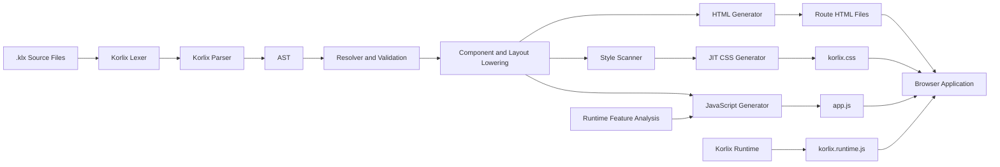

<div align="center">

# Korlix

**A frontend-first programming language for building websites with readable `.klx` files.**

[](https://www.npmjs.com/package/korlix)
[](https://www.npmjs.com/package/create-korlix)
[](https://www.rust-lang.org/)
[](LICENSE)

**Korlix = Kor + Lix = The Core Matrix**

Write pages, components, state, styles, themes, API requests and browser behavior in one language. Korlix compiles `.klx` source files into browser-native **HTML**, **CSS** and **JavaScript**.

[Documentation](docs/00-index.md) · [Getting Started](docs/01-getting-started.md) · [Examples](examples) · [Implementation Status](docs/18-implementation-status.md) · [Report an Issue](https://github.com/SachinRamasamy-cloud/korlix/issues)

</div>

---

## Project Overview

Korlix is an indentation-based frontend language and compiler designed to reduce the number of separate tools required to create ordinary websites and browser applications.

A Korlix project can define:

- Pages and routes
- Shared layouts
- Reusable user components
- Native HTML and SVG elements
- Reactive state and event handlers
- Functions, conditions and loops
- Korlix-native colors and utility classes
- Responsive and interaction variants
- Light, dark and automatic themes
- API queries and HTTP mutations
- Pagination, toast notifications, modals and drawers
- Static multipage output
- Experimental SPA output

Korlix applications do not require React, Vue, Angular, Bootstrap or Tailwind CSS at browser runtime. The compiler generates standard browser files and includes the Korlix runtime for application behavior.

```text
Korlix source
→ lexer
→ parser
→ semantic validation
→ component and layout lowering
→ JIT style generation
→ HTML + CSS + JavaScript
```

---

## Korlix at a Glance

```klx
app StoreApplication
  layout MainLayout
  theme auto

layout MainLayout
  navbar variant=glass
    strong "Korlix Store"
    link href="/products" "Products"
    theme-toggle

  main
    slot

component ProductSummary
  prop name: string
  prop price: number

  product-card variant=raised
    h3 "{name}"
    p "Price: {price}"

page Products at "/products"
  state page: int = 1
  state count: int = 0

  get products "/api/products"

  if productsLoading
    spinner
  else
    grid .grid-cols-1 .md:grid-cols-2 .xl:grid-cols-4
      for product in products
        ProductSummary name=product.name price=product.price

  pagination page=page total=100 perPage=20 url-sync

  button "Count: {count}" variant=primary click=increment

  fn increment
    count += 1
```

This example includes:

- An application-level layout
- Automatic light/dark theme selection
- A reusable typed component
- A routed page
- Reactive state
- A declarative API query
- Loading-state rendering
- Responsive layout utilities
- List iteration
- Pagination
- An event-driven function

---

## Current Capability Summary

| Area | Current implementation |
|---|---|
| Source extension | `.klx` |
| Compiler | Rust workspace |
| Generated output | HTML, CSS and JavaScript |
| Stable target | Static multipage builds |
| Experimental target | SPA builds |
| Native element names | 137 HTML and SVG names |
| Registered component names | 115 |
| Schema-defined components | 35 |
| Public color families | 26 |
| Color levels | `0` through `12` |
| Utility classes | More than 1,000 |
| Color utility combinations | More than 5,500 |
| Themes | Light, dark and automatic |
| Runtime modules | State, events, API, router, theme, toast, overlays, pagination and HMR |

> The component catalogue contains both specialized components and generic semantic components. All 115 names are registered, but they do not all have the same implementation maturity.

---

## Implementation Phases

### Phase 1 — Compiler Foundation

The first phase established the language-processing pipeline.

- Twelve-crate Rust workspace
- Indentation-aware lexer with `INDENT` and `DEDENT`
- Parser for applications, pages, layouts, components and expressions
- AST with source spans
- File, route and import-resolution foundations
- HTML, CSS and JavaScript generation
- Static route output
- CLI project scaffolding
- Development and preview servers

### Phase 2 — Styling and Browser Runtime

The second phase added interface styling and browser-side behavior.

- JIT utility CSS engine
- Color palettes and semantic design tokens
- Responsive and interaction variants
- Reactive state runtime
- Event binding
- Toast notifications
- Modal and drawer overlays
- Theme switching
- Router foundations
- Development hot updates

### Phase 3 — Components and Application Features

The third phase expanded Korlix into an application-oriented frontend language.

- Built-in component registry
- User-created components
- Typed props and default values
- Default slots
- Functions and actions
- Conditions and loops
- API queries and mutations
- Pagination
- Whole-project validation

### Phase 4 — Korlix V2 Foundation

The V2 phase simplified the syntax and expanded language coverage.

- `page Home at "/"` page syntax
- `fn` function declarations
- Optional trailing colons
- Indentation-only blocks
- `+=` and `-=` assignment
- String interpolation
- Modern HTML and common SVG registry
- Korlix-native color vocabulary
- Thirteen-level color scale
- Light, dark and automatic themes
- More than 100 component names
- Application default layouts
- Imported component and layout aliases
- Duplicate route and declaration validation
- Expanded documentation and conformance tests

---

## Language Features

### Pages and Routes

V2 syntax:

```klx
page About at "/about"
  h1 "About Korlix"
```

V1 syntax remains accepted:

```klx
page About route "/about":
  h1 "About Korlix"
```

### Layouts

```klx
layout MainLayout
  navbar
    link href="/" "Home"
    link href="/docs" "Documentation"

  slot

  footer
    p "Built with Korlix"
```

Layout selection order:

1. Page-specific layout
2. Application default layout
3. No layout

### Imports

```klx
import MainLayout from "./layouts/main.klx"
import UserCard from "./components/user-card.klx"
import "./setup.klx"
```

### User Components

```klx
component UserCard
  prop name: string
  prop role: string = "Member"
  prop active: bool = true

  card variant=raised
    h3 "{name}"
    p "{role}"

    if active
      badge variant=success "Active"

    slot
```

Usage:

```klx
UserCard name="Sachin" role="Administrator"
  button "Open profile" click=openProfile
```

Implemented component-language features:

- Required props
- Typed props
- Default prop values
- Default slot content
- Imported aliases
- Recursive expansion protection
- Missing-required-prop diagnostics
- Basic literal type validation

### State and Values

```klx
state count: int = 0
state loading: bool = false
state users = []
state currentUser = null

let pageSize = 20
derived total = price * quantity
```

Reactive page state is generated by the Korlix runtime. Top-level `let` initialization and reactive recomputation of `derived` declarations are still incomplete.

### Functions and Actions

```klx
fn increase(step)
  count = count + step

action reset
  count = 0
```

Supported function-body operations include:

- Local `let` values
- Assignments
- `+=` and `-=`
- Function calls
- Conditions
- Loops
- API requests
- Query reloads

### Conditions

```klx
if loading
  spinner
else
  p "Loaded"
```

### Loops

```klx
for user in users
  profile-card
    h3 "{user.name}"
    p "{user.role}"
```

### Expressions

Korlix supports:

- Strings, integers, floating-point numbers and Booleans
- `null`
- Lists and records
- Arithmetic operators
- Comparison operators
- Logical operators
- Member and index access
- Function calls
- String interpolation

```klx
state total = price * quantity
state visible = active and not loading
p "Welcome, {user.profile.name}"
```

### Events

Direct event property:

```klx
button "Save" click=save
input input=updateSearch
form submit=submitForm
```

Inline event block:

```klx
button "Increase" click
  count += 1
```

Supported events include click, double-click, input, change, submit, focus, blur, keyboard, mouse, scroll, drag, drop and touch events.

---

## HTML and SVG Support

Korlix recognizes 137 native HTML and SVG names across:

- Document metadata
- Semantic structure
- Text and inline semantics
- Lists
- Forms
- Tables
- Images, audio and video
- Embedded content
- Interactive elements
- Templates
- Common SVG shapes, gradients, masks, clipping and filters

Example:

```klx
article
  header
    h1 "Korlix Language Design"
    time datetime="2026-07-19" "19 July 2026"

  p "Korlix uses native semantic web elements."

  figure
    img src="/images/compiler.png" alt="Korlix compiler architecture"
    figcaption "The Korlix compilation pipeline"
```

Recognized void elements include:

```text
area, base, br, col, embed, hr, img,
input, link, meta, source, track, wbr
```

---

## Korlix Styling System

Korlix includes a JIT utility engine that generates rules for utility classes detected in the project source.

### Traditional Utility Prefixes

```text
text-, bg-, border-, ring-, fill-, stroke-, outline-, caret-, placeholder-
```

```klx
div .bg-indigo-600 .text-white .border-indigo-700
```

### Korlix-Native Color Prefixes

```text
surface-, content-, outline-, accent-, fill-, stroke-, ring-color-, caret-color-
```

```klx
card .surface-violet-2 .content-violet-11 .outline-violet-4
```

### Color Families

Base families:

```text
slate, gray, zinc, red, orange, amber, yellow,
green, emerald, teal, cyan, blue, indigo,
violet, purple, pink, rose
```

Aliases:

```text
neutral, ash, stone, sand, lime, mint, sky, coral, magenta
```

Each public family exposes Korlix levels `0` through `12`.

### Semantic Theme Tokens

```text
canvas, surface, raised, overlay, content, content-muted,
outline, brand, success, warning, danger, info
```

```klx
section .surface-canvas .content-content
  card .surface-raised .outline-outline
    h2 "Theme-aware content"
```

### Responsive Variants

| Prefix | Minimum width |
|---|---:|
| `sm:` | 576 px |
| `md:` | 768 px |
| `lg:` | 992 px |
| `xl:` | 1200 px |
| `2xl:` | 1400 px |

```klx
grid .grid-cols-1 .md:grid-cols-2 .xl:grid-cols-4
```

### State Variants

Korlix supports state variants such as:

```text
hover, focus, focus-visible, active, visited, disabled,
checked, invalid, valid, group-hover, peer-checked,
dark, data-open, motion-safe, motion-reduce and print
```

```klx
button .bg-indigo-600 .hover:bg-indigo-700 .disabled:opacity-50
```

### Arbitrary Values

```klx
div .w-[320px]
div .h-[calc(100vh-4rem)]
div .surface-[#101827]
div .grid-cols-[240px_1fr]
```

---

## Light, Dark and Automatic Themes

```klx
app MyApplication
  theme light
```

```klx
app MyApplication
  theme dark
```

```klx
app MyApplication
  theme auto
```

Add the built-in theme switcher:

```klx
theme-toggle
```

Or call the runtime behavior:

```klx
button "Change theme" click=toggleTheme
```

The runtime supports:

- Light mode
- Dark mode
- Automatic system mode
- Saved user preference
- `data-kx-theme`
- Browser `color-scheme`
- System-theme change detection
- `kx:theme-change` events

---

## Component Catalogue

Korlix registers 115 component names across:

- Navigation
- Forms
- Content
- Layout primitives
- Overlays
- Data display
- Media
- Feedback
- Loaders
- Marketing
- Avatar and profile UI
- E-commerce
- Dashboard UI

Representative components:

```text
navbar, sidebar, breadcrumb, tabs, stepper,
card, product-card, profile-card, pricing-card, stat-card,
button, input, select, checkbox, switch, date-picker, file-upload,
alert, toast, spinner, skeleton, empty-state,
modal, drawer, tooltip, dropdown,
table, data-table, pagination, calendar,
carousel, gallery, video-player,
container, row, column, grid, stack
```

### Component Maturity

- **35 schema-defined components** have dedicated props, slots and output rules.
- **80 generic catalogue components** share common variant, size, disabled and slot behavior.
- A smaller group has specialized lowering or runtime behavior.

Specialized components currently include:

```text
button, link, icon, image, avatar, card, navbar, footer,
container, section, hero, badge, alert, spinner, skeleton,
empty-state, toast, modal, drawer, pagination, progress,
theme-toggle
```

See [Components](docs/07-components.md) and the [V2 Component Catalogue](docs/15-component-catalog-v2.md).

---

## API Requests

### Declarative GET Query

```klx
get users "/api/users"
```

The current compiler exposes:

```text
users
usersLoading
usersError
```

Example:

```klx
page Users at "/users"
  get users "/api/users"

  if usersLoading
    spinner
  else
    for user in users
      profile-card
        h3 "{user.name}"
```

### HTTP Mutations

```klx
post "/api/users" user
put "/api/users/1" user
patch "/api/users/1" changes
delete "/api/users/1"
```

### Reload a Query

```klx
reload users
```

### Runtime API

```javascript
KorlixRuntime.api.get(url, options)
KorlixRuntime.api.post(url, body, options)
KorlixRuntime.api.put(url, body, options)
KorlixRuntime.api.patch(url, body, options)
KorlixRuntime.api.delete(url, options)
KorlixRuntime.api.reload(name)
```

The browser runtime uses `fetch`, supports JSON and text responses, and stores query loading and error state.

Declarative headers, query-parameter blocks, authentication, retries, caching, timeout and cancellation remain future API-language work.

---

## Pagination

```klx
pagination
  page=currentPage
  total=totalRecords
  perPage=20
  siblings=1
  url-sync
```

Implemented behavior:

- First and last controls
- Previous and next controls
- Numbered pages
- Ellipsis
- Boundary disabled states
- `aria-current`
- Explicit page count
- Total-record calculation
- URL query synchronization
- `change` and `kx:page-change` events

Pagination emits page-change events. Updating application state still requires an attached event handler.

---

## Built-in Runtime Functions

Korlix functions can dispatch built-in browser actions:

```text
toast
showToast
openModal
closeModal
openDrawer
closeDrawer
navigate
goBack
toggleTheme
scrollTo
copyToClipboard
log
```

Example:

```klx
fn copyCode
  copyToClipboard(code)
  toast("success", "Copied")
```

Runtime modules include:

- State and events
- API requests
- Router
- Themes
- Toast notifications
- Overlays
- Pagination
- Development hot updates

---

## Architecture



### Rust Workspace

| Crate | Responsibility |
|---|---|
| `korlix-cli` | Command-line interface |
| `korlix-core` | Configuration, diagnostics and source handling |
| `korlix-lexer` | Tokenization and indentation |
| `korlix-parser` | Tokens to AST |
| `korlix-ast` | Language syntax structures |
| `korlix-resolver` | File, import, route and symbol resolution |
| `korlix-style` | Utility registry and JIT CSS generation |
| `korlix-components` | Component schemas and expansion |
| `korlix-runtime-plan` | Runtime feature analysis |
| `korlix-codegen` | HTML, CSS, JavaScript and route generation |
| `korlix-dev-server` | Development server, watcher and WebSocket updates |
| `korlix-compiler` | Whole-project compilation pipeline |

---

## Quick Start

### Create a Project with npm

Prerequisite: Node.js 18 or newer.

```bash
npm create korlix@latest my-app
cd my-app
npm install
npm run dev
```

Open:

```text
http://localhost:3000
```

Optional creator flags:

```bash
npm create korlix@latest my-app -- --install
npm create korlix@latest my-app -- --start
```

Other package managers:

```bash
yarn create korlix my-app
pnpm create korlix my-app
bun create korlix my-app
```

> The source repository can contain V2 changes ahead of a packaged npm binary. Build from source when validating the latest compiler behavior.

### Build the Latest Compiler from Source

Prerequisites:

- Rust 1.75 or newer
- Git
- Node.js 18 or newer only when rebuilding the TypeScript runtime

```bash
git clone https://github.com/SachinRamasamy-cloud/korlix.git
cd korlix
cargo build --release
```

The binary is created at:

```text
target/release/korlix
```

Install globally:

```bash
cargo install --path crates/korlix-cli
```

Verify:

```bash
korlix --version
```

Create a project:

```bash
korlix new my-site
cd my-site
korlix dev
```

---

## CLI Commands

| Command | Purpose |
|---|---|
| `korlix new <name>` | Create a Korlix project |
| `korlix dev` | Start the development server with file watching |
| `korlix check` | Parse, validate and lint `.klx` files |
| `korlix check --ast` | Print the parsed AST as JSON |
| `korlix build --mode static` | Build a static multipage website |
| `korlix build --mode spa` | Build experimental SPA output |
| `korlix preview --port 4173` | Preview the production build |

The CLI accepts `--a11y`, `--security` and `--seo`, but dedicated checks for those modes are not yet complete.

---

## Generated Project Structure

```text
my-site/
├── korlix.config.json
├── package.json
├── public/
│   └── index.html
├── src/
│   ├── main.klx
│   ├── app.klx
│   ├── pages/
│   │   └── index.klx
│   ├── layouts/
│   ├── components/
│   └── theme/
│       └── tokens.klx
└── dist/
```

Generated npm scripts:

```bash
npm run dev
npm run check
npm run build
npm run preview
```

---

## Repository Structure

```text
korlix/
├── crates/
│   ├── korlix-cli/
│   ├── korlix-core/
│   ├── korlix-lexer/
│   ├── korlix-parser/
│   ├── korlix-ast/
│   ├── korlix-resolver/
│   ├── korlix-style/
│   ├── korlix-components/
│   ├── korlix-runtime-plan/
│   ├── korlix-codegen/
│   ├── korlix-dev-server/
│   └── korlix-compiler/
├── runtime/
├── npm/
│   ├── korlix/
│   └── create-korlix/
├── examples/
│   ├── landing-page/
│   ├── spa-dashboard/
│   ├── v2-showcase/
│   └── complete-showcase/
├── docs/
├── Cargo.toml
├── Cargo.lock
├── SETUP.md
├── CHANGELOG.md
├── LICENSE
└── README.md
```

---

## Generated Build Output

```text
dist/
├── index.html
├── about/
│   └── index.html
├── products/
│   └── index.html
├── assets/
│   ├── korlix.css
│   ├── korlix.runtime.js
│   └── app.js
├── korlix.routes.json
└── korlix.manifest.json
```

Public assets are copied into the output directory.

---

## Project Configuration

`korlix.config.json`:

```json
{
  "name": "my-korlix-app",
  "version": "0.1.0",
  "src": "src",
  "public": "public",
  "dist": "dist",
  "mode": "static",
  "theme": {
    "default": "auto",
    "dark": true
  },
  "server": {
    "port": 3000,
    "host": "localhost"
  }
}
```

Currently active configuration includes source, public and output paths, project name, server port and build mode.

---

## Compiler Diagnostics

The compiler checks include:

- Lexer and parser errors
- Unknown utility classes
- Utility-class suggestions
- Duplicate pages, layouts, components and routes
- Duplicate local symbols and props
- Unknown components
- Missing required user-component props
- Basic literal type mismatches
- Unsupported build modes

Representative diagnostic codes:

```text
KX-E001, KX-E002, KX-E010, KX-E011, KX-E012,
KX-E201, KX-S101, KX-S102, KX-S110, KX-S111,
KX-S210, KX-T101, KX-C301
```

---

## Development and Testing

Format the Rust workspace:

```bash
cargo fmt --all
```

Check the workspace:

```bash
cargo check --workspace
```

Run the tests:

```bash
cargo test --workspace
```

Validate the browser runtime:

```bash
node --check crates/korlix-compiler/runtime-bundle/korlix.runtime.js
```

Build the V2 example:

```bash
cd examples/v2-showcase
../../target/release/korlix check
../../target/release/korlix build --mode static
```

---

## Rebuilding the Runtime

The pre-bundled runtime is stored at:

```text
crates/korlix-compiler/runtime-bundle/korlix.runtime.js
```

Rebuild it from TypeScript:

```bash
cd runtime
npm install
npm run build
cp dist/korlix.runtime.js ../crates/korlix-compiler/runtime-bundle/
```

---

## Included Examples

| Example | Purpose |
|---|---|
| `examples/landing-page` | Static multipage landing-page project with shared layout and marketing sections |
| `examples/spa-dashboard` | Dashboard-style project using experimental SPA configuration |
| `examples/v2-showcase` | Focused V2 syntax, components, state, responsive styles, themes, pagination and API syntax |
| `examples/complete-showcase` | Comprehensive multipage project covering implemented language, HTML/SVG, styling, components, forms, runtime, API, overlays, pagination and themes |

---

## Current Project Status

Korlix currently provides a tested V2 language foundation. **Static multipage compilation is the stable target.**

The following areas remain incomplete or experimental:

- Full record-shape and flow-sensitive type checking
- Undefined identifier and function validation
- Complete runtime behavior for top-level `let` and `derived`
- Complete component-instance state isolation
- Named slots and event forwarding
- Specialized behavior for every registered component
- Declarative API headers, params, authentication, retry and timeout
- Complete SPA page mounting and unmounting
- Strict Content Security Policy compatibility
- Dedicated accessibility, security and SEO checks
- Server-side rendering and data-driven SSG
- Package management
- Formatter and language-server tooling
- Complete JavaScript and TypeScript interoperability

See [Implementation Status](docs/18-implementation-status.md) for the full matrix.

---

## Engineering Notes

- Indentation is part of the Korlix grammar.
- V1 and V2 syntax are both accepted during migration.
- The style scanner generates CSS from utilities found in source files.
- Application layouts are applied before final component lowering.
- Component aliases are resolved through imported `.klx` modules.
- Static routes generate directory-based HTML files.
- Page state is route-gated to reduce cross-page collisions.
- Generic catalogue components produce semantic output but may not implement advanced interaction behavior.
- SPA mode should be treated as experimental until route-level page replacement is complete.

---

## Roadmap

- Expanded semantic and type analysis
- Complete component behavior and accessibility contracts
- Isolated component state and lifecycle
- Declarative API configuration
- Full SPA route mounting
- Formatter
- Language Server Protocol support
- Editor extensions
- Source maps and improved debugging
- Runtime feature tree-shaking
- CSP-compatible event generation
- Package ecosystem
- SSR and SSG
- Plugin and component extension APIs

---

## Documentation

- [Documentation Index](docs/00-index.md)
- [Getting Started](docs/01-getting-started.md)
- [Project Structure](docs/02-project-structure.md)
- [Language Syntax](docs/03-syntax.md)
- [Colors and Utilities](docs/06-colors-and-utilities.md)
- [Components](docs/07-components.md)
- [State, Events and Functions](docs/09-state-events-functions.md)
- [Compiler Architecture](docs/11-compiler-architecture.md)
- [Korlix V2 Language](docs/12-korlix-v2-language.md)
- [HTML Reference](docs/13-html-reference.md)
- [Colors and Themes](docs/14-korlix-colors-and-themes.md)
- [V2 Component Catalogue](docs/15-component-catalog-v2.md)
- [API and Pagination](docs/16-scripting-api-pagination.md)
- [Testing and Conformance](docs/17-testing-and-conformance.md)
- [Implementation Status](docs/18-implementation-status.md)

---

## Contributing

Contributions are welcome across the compiler, parser, styling engine, components, browser runtime, diagnostics, tests, documentation and examples.

```bash
git clone https://github.com/SachinRamasamy-cloud/korlix.git
cd korlix
cargo check --workspace
cargo test --workspace
```

Create a focused branch, include tests for language changes, and document compatibility effects in the pull request.

---

## License

Korlix is released under the [MIT License](LICENSE).

---

## Author

**Sachin Ramasamy**  
Full-Stack Developer

- Portfolio: https://sachinrtech.vercel.app/
- GitHub: https://github.com/SachinRamasamy-cloud
- Repository: https://github.com/SachinRamasamy-cloud/korlix
